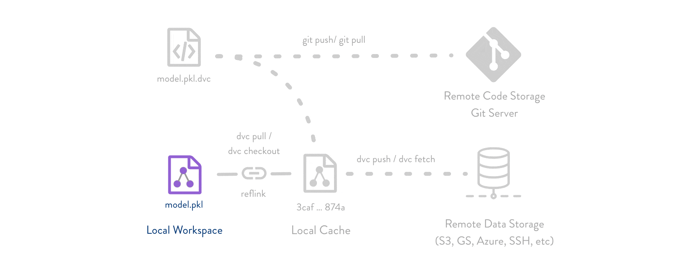

# Continuous Machine Learning project integration with DVC

**[Data Version Control](https://github.com/iterative/dvc)** or **DVC** is an **open-source** tool for data science and machine learning projects. It allows for different versioning and management of datasets and Machine Learning models.

Using github actions we can actually generate ML results for every Pull request and have the info we need right there,
